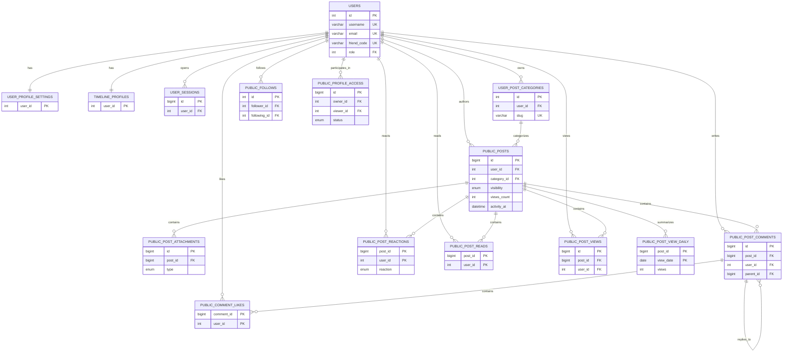
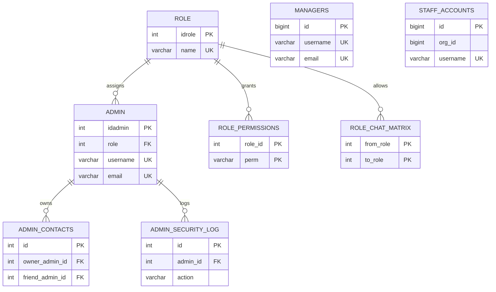
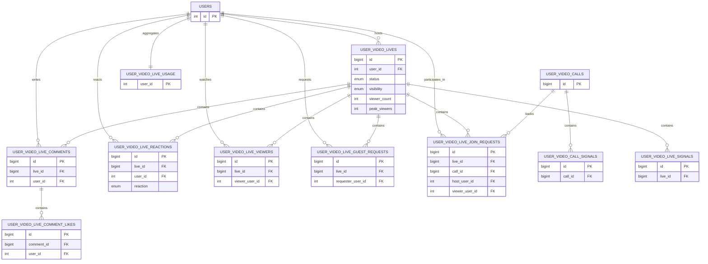
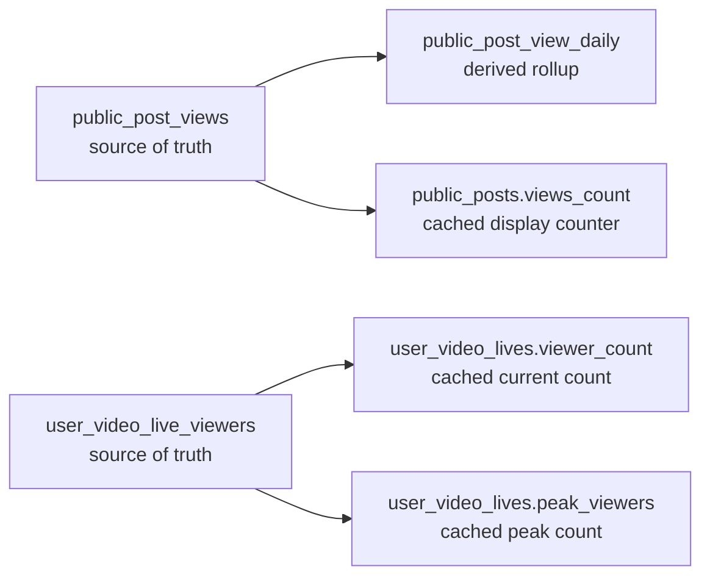

# Senior Backend Engineer Database System Architecture

This document explains the database system architecture behind [Talentra.sql](https://github.com/ijc3093/Business3/blob/master/Data/Talentra.sql:27) across the three main project surfaces:

- `admin`
- `organization`
- `public_user`

This is the architecture view. The detailed table-by-table change guide is in [Senior_Backend_Engineer _database_update_guide.md](https://github.com/ijc3093/Business3/blob/master/public_user/docs/Senior_Backend_Engineer%20_database_update_guide.md).

## 1. What this database is doing

The database is not one simple app schema. It is one shared schema serving multiple product surfaces:

1. `admin` for internal administration, security, roles, managers, and staff governance.
2. `organization` for organization workspaces, org feeds, org rooms, invites, and org messaging.
3. `public_user` for users, profiles, public posts, follows, privacy, notifications, sessions, and live video.
4. shared messaging and realtime infrastructure used by more than one surface.

The database therefore behaves like one platform database with several bounded domains inside it.

## 2. Top-level architecture

```mermaid
flowchart TD
    DB["Talentra SQL Database"]

    ADMIN["Admin Domain"]
    ORG["Organization Domain"]
    PUBLIC["Public User Domain"]
    SHARED["Shared Infrastructure"]
    HARDEN["Integrity and Hardening Layer"]

    DB --> ADMIN
    DB --> ORG
    DB --> PUBLIC
    DB --> SHARED
    DB --> HARDEN

    ADMIN --> A1["Admin Accounts and Security"]
    ADMIN --> A2["Managers, Staff, Shared Roles"]

    ORG --> O1["Organizations and Members"]
    ORG --> O2["Org Feed and Attachments"]
    ORG --> O3["Org Rooms and Messaging"]

    PUBLIC --> P1["Users and Profile Settings"]
    PUBLIC --> P2["Public Posts and Privacy"]
    PUBLIC --> P3["Sessions and Notifications"]
    PUBLIC --> P4["Live Video and Realtime"]

    SHARED --> S1["Contacts, Conversations, Messages"]
    SHARED --> S2["Legacy Feedback Streams"]
    SHARED --> S3["Shared Post Primitives"]
    SHARED --> S4["Capsules and Time-Locked Content"]
    SHARED --> S5["Realtime Signaling Tables"]

    HARDEN --> H1["Foreign Keys"]
    HARDEN --> H2["Indexes"]
    HARDEN --> H3["Triggers"]
    HARDEN --> H4["Counter Rollups"]
    HARDEN --> H5["Data Cleanup Rules"]
```

## 3. Domain boundaries

### Admin domain

Main purpose:

- internal account management
- internal contacts
- audit/security logging
- role-driven governance

Main tables:

- `admin`
- `admin_contacts`
- `admin_security_log`
- `managers`
- `staff_accounts`
- `role`
- `roles`
- `role_chat_matrix`
- `role_permissions`

Main idea:

- `admin` is the internal control-plane identity.
- `managers` and `staff_accounts` extend internal and organization-facing access models.
- `role` is the shared role catalog that both admin and user identity models reference.

### Organization domain

Main purpose:

- represent an organization/workspace
- attach members and roles to it
- provide an org feed
- provide rooms and private org messaging

Main tables:

- `organizations`
- `organization_users`
- `org_members`
- `org_roles`
- `org_role_permissions`
- `org_posts`
- `org_post_attachments`
- `org_post_comments`
- `org_post_likes`
- `org_post_views`
- `org_post_flags`
- `org_post_acknowledgements`
- `org_messages`
- `org_message_threads`
- `org_rooms`
- `org_room_members`
- `org_room_messages`
- `org_invites`
- `org_settings`
- `org_feed_reads`

Main idea:

- `organizations` is the root.
- `org_members` is the canonical membership ledger.
- content, rooms, messages, and invites all hang under the organization boundary.

### Public-user domain

Main purpose:

- user identity and sessions
- public/friends posting
- profile access/privacy
- follows and social graph
- live sessions and live engagement

Main tables:

- `users`
- `timeline_profiles`
- `user_profile_settings`
- `user_sessions`
- `public_follows`
- `public_profile_access`
- `user_post_categories`
- `public_posts`
- `public_post_attachments`
- `public_post_comments`
- `public_comment_likes`
- `public_post_reactions`
- `public_post_reads`
- `public_post_saves`
- `public_post_shares`
- `public_post_tags`
- `public_post_views`
- `public_post_view_daily`
- `public_saved_posts`
- `user_video_lives`
- `user_video_live_comments`
- `user_video_live_comment_likes`
- `user_video_live_guest_requests`
- `user_video_live_join_requests`
- `user_video_live_reactions`
- `user_video_live_viewers`
- `user_video_live_usage`
- `user_video_calls`
- `user_video_call_signals`
- `user_video_live_signals`

Main idea:

- `users` is the root identity table.
- `public_posts` is the root public-content table.
- `user_video_lives` is the root live-content table.

### Shared infrastructure domain

Main purpose:

- shared messaging patterns
- shared signaling patterns
- shared content primitives used outside the pure public-post model

Main tables:

- `contacts`
- `contact_requests`
- `chat_messages`
- `chat_groups`
- `chat_group_members`
- `chat_group_messages`
- `chat_group_hidden_messages`
- `chat_typing`
- `conversations`
- `conversation_participants`
- `messages`
- `message_reads`
- `feedback`
- `feedback_admin`
- `posts`
- `post_audience`
- `post_media`
- `capsules`
- `capsule_contributors`
- `capsule_entries`
- `group_video_calls`
- `group_video_call_participants`
- `group_video_call_signals`
- `live_studio_sessions`
- `live_studio_presence`
- `live_studio_comments`
- `live_studio_reactions`
- `live_studio_signals`
- `live_studio_watch_sessions`
- `notification`

## 4. System relationship map

This is the high-level ownership map.

```mermaid
erDiagram
    ROLE ||--o{ ADMIN : "governs"
    ROLE ||--o{ USERS : "governs"

    ORGANIZATIONS ||--o{ ORGANIZATION_USERS : "links"
    ORGANIZATIONS ||--o{ ORG_MEMBERS : "owns"
    ORGANIZATIONS ||--o{ ORG_ROLES : "defines"
    ORGANIZATIONS ||--o{ ORG_POSTS : "publishes"
    ORGANIZATIONS ||--o{ ORG_ROOMS : "contains"
    ORGANIZATIONS ||--|| ORG_SETTINGS : "configures"
    ORGANIZATIONS ||--o{ ORG_INVITES : "issues"

    USERS ||--o{ USER_SESSIONS : "authenticates"
    USERS ||--|| TIMELINE_PROFILES : "extends"
    USERS ||--|| USER_PROFILE_SETTINGS : "configures"
    USERS ||--o{ USER_POST_CATEGORIES : "owns"
    USERS ||--o{ PUBLIC_POSTS : "authors"
    USERS ||--o{ PUBLIC_FOLLOWS : "links"
    USERS ||--o{ PUBLIC_PROFILE_ACCESS : "approves"
    USERS ||--o{ USER_VIDEO_LIVES : "hosts"

    PUBLIC_POSTS ||--o{ PUBLIC_POST_ATTACHMENTS : "has"
    PUBLIC_POSTS ||--o{ PUBLIC_POST_COMMENTS : "has"
    PUBLIC_POSTS ||--o{ PUBLIC_POST_REACTIONS : "has"
    PUBLIC_POSTS ||--o{ PUBLIC_POST_READS : "has"
    PUBLIC_POSTS ||--o{ PUBLIC_POST_SAVES : "has"
    PUBLIC_POSTS ||--o{ PUBLIC_POST_SHARES : "has"
    PUBLIC_POSTS ||--o{ PUBLIC_POST_TAGS : "has"
    PUBLIC_POSTS ||--o{ PUBLIC_POST_VIEWS : "has"
    PUBLIC_POSTS ||--o{ PUBLIC_POST_VIEW_DAILY : "rolls_up_to"

    USER_VIDEO_LIVES ||--o{ USER_VIDEO_LIVE_COMMENTS : "has"
    USER_VIDEO_LIVES ||--o{ USER_VIDEO_LIVE_REACTIONS : "has"
    USER_VIDEO_LIVES ||--o{ USER_VIDEO_LIVE_VIEWERS : "has"
    USER_VIDEO_LIVES ||--o{ USER_VIDEO_LIVE_GUEST_REQUESTS : "has"
    USER_VIDEO_LIVES ||--o{ USER_VIDEO_LIVE_JOIN_REQUESTS : "has"
```

## 5. Public-user architecture

### Public-user domain diagram

### Public-user design rules

Root entities:

- `users`
- `public_posts`
- `user_video_lives`

Ownership:

- a user owns categories, sessions, public posts, and live sessions
- a public post owns public attachments, comments, reactions, reads, views, shares, tags, and saves
- a live session owns live comments, reactions, viewers, and join workflows

Privacy:

- `public_follows` defines the follower graph
- `public_profile_access` defines approval-based viewing
- `user_profile_settings` defines user privacy defaults

Important runtime rule:

- event tables are the source of truth
- display counters are usually derived or cached

## 6. Organization architecture

### Organization domain diagram

```mermaid
erDiagram
    ORGANIZATIONS {
        bigint id PK
        varchar org_code UK
    }

    ORGANIZATION_USERS {
        bigint id PK
        bigint org_id FK
        bigint user_id
    }

    ORG_MEMBERS {
        bigint id PK
        bigint org_id FK
        bigint role_id FK
    }

    ORG_ROLES {
        bigint id PK
        bigint org_id FK
        varchar name
    }

    ORG_ROLE_PERMISSIONS {
        bigint role_id PK
        varchar perm_key PK
    }

    ORG_POSTS {
        bigint id PK
        bigint org_id FK
        bigint author_id
        enum author_role
        enum post_type
    }

    ORG_POST_ATTACHMENTS {
        bigint id PK
        bigint org_id FK
        bigint post_id FK
    }

    ORG_POST_COMMENTS {
        bigint id PK
        bigint post_id FK
        bigint parent_comment_id FK
    }

    ORG_POST_LIKES {
        bigint post_id PK
        bigint user_id PK
    }

    ORG_POST_VIEWS {
        bigint post_id PK
        bigint user_id PK
    }

    ORG_ROOMS {
        bigint id PK
        bigint org_id FK
    }

    ORG_ROOM_MEMBERS {
        bigint room_id PK
        bigint member_id PK
    }

    ORG_ROOM_MESSAGES {
        bigint id PK
        bigint org_id FK
        bigint room_id FK
    }

    ORG_MESSAGE_THREADS {
        int id PK
        bigint org_id FK
    }

    ORG_MESSAGES {
        bigint id PK
        bigint org_id FK
        int thread_id FK
    }

    ORG_INVITES {
        bigint id PK
        bigint org_id FK
    }

    ORG_SETTINGS {
        bigint org_id PK
    }

    ORGANIZATIONS ||--o{ ORGANIZATION_USERS : "links_users"
    ORGANIZATIONS ||--o{ ORG_MEMBERS : "owns"
    ORGANIZATIONS ||--o{ ORG_ROLES : "defines"
    ORGANIZATIONS ||--o{ ORG_POSTS : "publishes"
    ORGANIZATIONS ||--o{ ORG_ROOMS : "contains"
    ORGANIZATIONS ||--o{ ORG_MESSAGE_THREADS : "contains"
    ORGANIZATIONS ||--o{ ORG_MESSAGES : "contains"
    ORGANIZATIONS ||--o{ ORG_INVITES : "issues"
    ORGANIZATIONS ||--|| ORG_SETTINGS : "configures"

    ORG_ROLES ||--o{ ORG_ROLE_PERMISSIONS : "grants"
    ORG_POSTS ||--o{ ORG_POST_ATTACHMENTS : "has"
    ORG_POSTS ||--o{ ORG_POST_COMMENTS : "has"
    ORG_POSTS ||--o{ ORG_POST_LIKES : "has"
    ORG_POSTS ||--o{ ORG_POST_VIEWS : "has"
    ORG_ROOMS ||--o{ ORG_ROOM_MEMBERS : "has"
    ORG_ROOMS ||--o{ ORG_ROOM_MESSAGES : "has"
    ORG_MESSAGE_THREADS ||--o{ ORG_MESSAGES : "contains"
    ORG_POST_COMMENTS ||--o{ ORG_POST_COMMENTS : "replies_to"
```

### Organization design rules

Root entity:

- `organizations`

Core membership model:

- `organization_users` is a direct link table
- `org_members` is the broader canonical membership ledger
- `org_roles` and `org_role_permissions` define organization-local authorization

Content model:

- `org_posts` is the organization feed root
- attachments, comments, likes, views, acknowledgements, and flags hang from `org_posts`

Communication model:

- `org_rooms` and `org_room_messages` handle room-style communication
- `org_message_threads` and `org_messages` handle direct-thread messaging

## 7. Admin and internal architecture

### Admin/internal domain diagram

### Admin design rules

Control-plane identity:

- `admin` is the internal superuser and admin account ledger

Security:

- `admin_security_log` is the audit trail for admin authentication events
- `password_reset_tokens` also supports admin account recovery

Authorization:

- `role`, `role_permissions`, and `role_chat_matrix` define shared role behavior

Related internal actors:

- `managers` and `staff_accounts` are adjacent identity models used by internal and organization features

## 8. Live and realtime architecture

### Live session diagram

### Live design rules

Source of truth:

- `user_video_live_viewers` is the source-of-truth active-presence table

Cached counters:

- `user_video_lives.viewer_count`
- `user_video_lives.peak_viewers`

Integrity model:

- live child tables should always point to a valid `user_video_lives.id`
- live user actors should always point to valid `users.id`
- join flows may optionally point to `user_video_calls.id`

## 9. Source-of-truth vs cache architecture

This is one of the most important design rules in the current schema.

Current rule:

- trust the event or presence table first
- rebuild cached numbers from source tables if they drift

Examples:

- trust `public_post_views` before trusting `public_posts.views_count`
- trust `user_video_live_viewers` before trusting `user_video_lives.viewer_count`

## 10. Relationship patterns used in this schema

The schema uses the same relationship patterns repeatedly.

### Pattern A: root entity with many child event tables

Examples:

- `public_posts` -> comments, reactions, views, reads, saves, tags, shares
- `user_video_lives` -> comments, reactions, viewers, join requests
- `org_posts` -> comments, likes, views, flags, acknowledgements

### Pattern B: identity root with preference or profile extension tables

Examples:

- `users` -> `timeline_profiles`
- `users` -> `user_profile_settings`
- `users` -> `user_sessions`

### Pattern C: local role model inside a larger domain

Examples:

- shared role model: `role`, `role_permissions`, `role_chat_matrix`
- organization role model: `org_roles`, `org_role_permissions`

### Pattern D: event table plus derived summary table

Examples:

- `public_post_views` -> `public_post_view_daily`
- `user_video_live_viewers` -> `viewer_count` and `peak_viewers`

## 11. Relationship risks and current technical debt

These are the main architecture issues still visible in the schema:

1. `public_post_saves` and `public_saved_posts` overlap in responsibility.
2. `role` and `roles` both exist, which creates naming ambiguity.
3. Some status fields are true enums while others are free-form `varchar`.
4. Mixed ID types still exist in older parts of the schema.
5. Some older shared tables use `friend_code` or username-style references instead of a single consistent numeric FK model.

## 12. How to think about the database safely

Use this mental model:

1. find the root table for the feature
2. find the child event tables hanging from it
3. separate source-of-truth tables from caches
4. check foreign keys and unique keys before changing write logic
5. treat old duplicate/legacy tables as compatibility surfaces until they are consolidated

Feature roots:

- admin features: `admin`
- organization features: `organizations`
- public identity features: `users`
- public post features: `public_posts`
- live features: `user_video_lives`

## 13. SQL anchors

Use these links when reading the actual dump:

- Schema guide block: [Talentra.sql](https://github.com/ijc3093/Business3/blob/master/Data/Talentra.sql:27)
- Admin domain divider: [Talentra.sql](https://github.com/ijc3093/Business3/blob/master/Data/Talentra.sql:167)
- Organization domain divider: [Talentra.sql](https://github.com/ijc3093/Business3/blob/master/Data/Talentra.sql:1900)
- Public social divider: [Talentra.sql](https://github.com/ijc3093/Business3/blob/master/Data/Talentra.sql:2333)
- Public identity divider: [Talentra.sql](https://github.com/ijc3093/Business3/blob/master/Data/Talentra.sql:2875)
- Public live divider: [Talentra.sql](https://github.com/ijc3093/Business3/blob/master/Data/Talentra.sql:3330)
- Index section: [Talentra.sql](https://github.com/ijc3093/Business3/blob/master/Data/Talentra.sql:3752)
- Constraint section: [Talentra.sql](https://github.com/ijc3093/Business3/blob/master/Data/Talentra.sql:5060)
- Hardening block: [Talentra.sql](https://github.com/ijc3093/Business3/blob/master/Data/Talentra.sql:5249)

## 14. Recommended reading order

If you want to understand the whole system clearly:

1. Read the top schema guide comments in `Talentra.sql`.
2. Read this architecture document.
3. Read the detailed update guide.
4. Then inspect the specific domain tables you are changing.

That order gives you:

- system boundaries first
- relationships second
- detailed table behavior third
- implementation detail last
