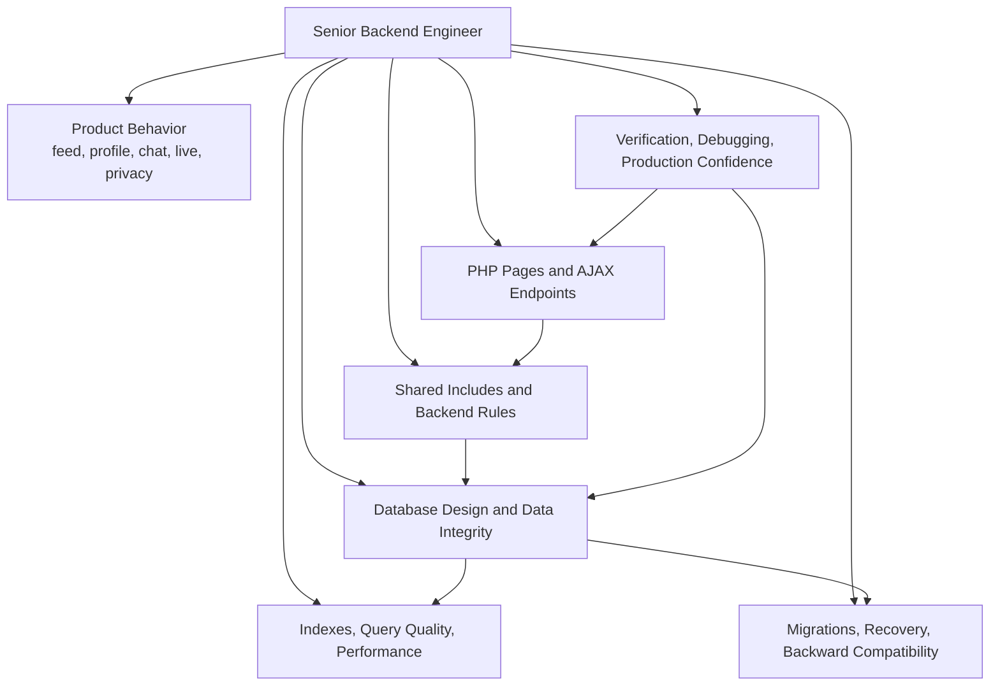
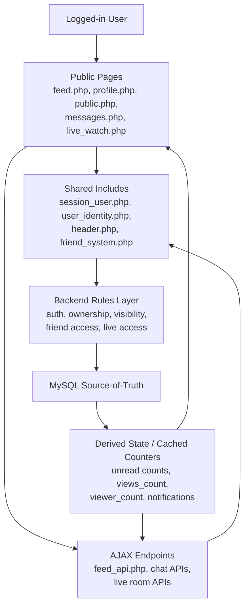
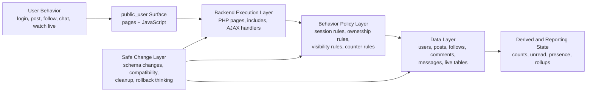
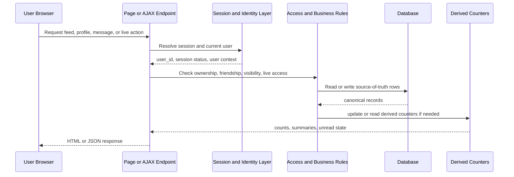
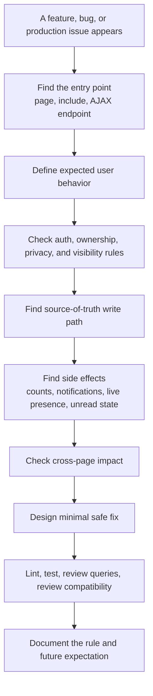
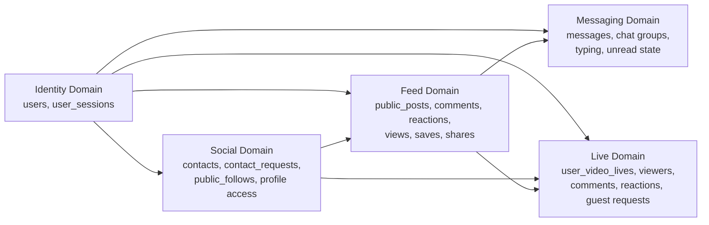
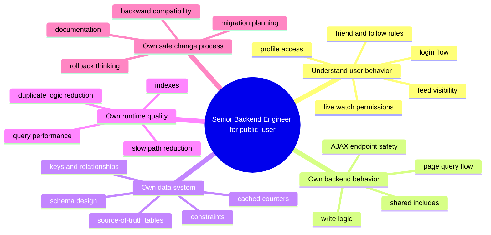

Software Engineer / Developer Notes for public_user
Date: 2026-04-23

Purpose

This document explains:

1. what I recently did in public_user
2. how the public_user project is running
3. which files are responsible for which parts
4. what is already verified
5. what should be improved next, safely
6. how a Senior Backend Engineer should think about the system design and runtime behavior

==================================================
0. Senior Backend Engineer introduction for public_user
==================================================

A Senior Backend Engineer working on `public_user` is responsible for more than fixing single PHP pages.

The real job is to protect the behavior of the whole product:

1. keep identity, access control, and session behavior correct
2. keep database reads and writes consistent with the product rules
3. make sure shared helpers do not create hidden cross-page bugs
4. keep AJAX endpoints predictable for frontend code
5. improve the system without breaking existing user flows

Senior Backend Engineer operating model:

This diagram is the backend ownership view:

1. the engineer stands in the middle of product behavior and technical safety
2. they do not only write page code
3. they own rules, data consistency, performance, and safe evolution of the system

For `public_user`, this means the engineer has to think in three layers at the same time:

1. page behavior: what the user sees on `feed.php`, `profile.php`, `public.php`, `messages.php`, and live pages
2. backend behavior: which PHP file loads data, validates access, and writes changes
3. data behavior: which database tables are source-of-truth, which tables are child records, and which counters are cached values

The important mindset is:

- do not treat pages as isolated files
- treat `public_user` as one connected application with shared session state, shared identity helpers, shared feed logic, and shared live/chat infrastructure
- assume one weak shared helper can damage many pages at once

In practice, a Senior Backend Engineer should always ask:

1. where is the source-of-truth for this feature
2. which file is allowed to write it
3. which pages and AJAX endpoints depend on it
4. what could become inconsistent if this write fails halfway
5. how this change affects existing runtime behavior

==================================================
0.1 System design and architecture mindset
==================================================

`public_user` should be understood as a multi-layer PHP application that sits on top of one shared MySQL database.

At a high level, the architecture is:

1. browser pages render the main user surfaces
2. shared include files enforce session, identity, and repeated UI/query behavior
3. AJAX endpoints provide incremental updates for feed, chat, and live features
4. the database stores durable state for users, posts, relationships, messages, and live sessions

The backend engineer's role is to keep the contract between those layers clean.

That contract is:

- pages should not invent business rules separately from shared helpers
- shared helpers should not resolve identity in fragile ways
- AJAX endpoints should validate the same access rules as full pages
- database rows should reflect the same ownership and visibility rules enforced in PHP

For this project, the best architecture view is to think in bounded behavior domains:

1. identity and session domain
2. social graph and relationship domain
3. public post and feed domain
4. messaging and conversation domain
5. live streaming and realtime domain

Each domain has its own source-of-truth tables, but the user experience crosses all of them. A user can log in, load the header, open the feed, react to content, enter a message thread, and join a live room in one session. Because of that, backend changes must be designed for cross-domain safety, not just single-file correctness.

Related reference documents:

- [Senior_Backend_Engineer_database_system_architecture.md](/Applications/MAMP/htdocs/Talentra/public_user/docs/Senior_Backend_Engineer_database_system_architecture.md)
- [Senior_Backend_Engineer _database_update_guide.md](/Applications/MAMP/htdocs/Talentra/public_user/docs/Senior_Backend_Engineer%20_database_update_guide.md)

System design diagram:

How to read this diagram:

1. the user enters through a page
2. the page depends on shared include files
3. dynamic features call AJAX endpoints
4. both pages and AJAX must pass through the same rule layer
5. the database holds durable records
6. some UI values come from derived counters, but those should still trace back to source-of-truth tables

Senior Backend Engineer system design view:

What this means:

1. user behavior starts the request
2. backend execution handles the request
3. policy decides what is allowed
4. the data layer stores the truth
5. derived state supports fast UX
6. the engineer must be able to change all of this safely without breaking old pages

==================================================
0.2 How a Senior Backend Engineer reads public_user behavior
==================================================

The safest way to understand `public_user` behavior is to trace it from request to database and back.

Use this reading order:

1. identify the entry page or AJAX endpoint
2. identify which session helper and identity helper it loads
3. identify which tables it reads and writes
4. identify which access rules are checked in PHP
5. identify which counters or side effects are updated
6. identify which other pages depend on the same shared logic

Example:

- `feed.php` is not only a page shell
- it depends on shared session enforcement
- it depends on shared header state
- it depends on feed queries and visibility rules
- it often depends on AJAX follow-up requests for dynamic behavior

This is why Senior Backend Engineer work in `public_user` is mostly about dependency awareness.

The engineer should look for:

- repeated SQL logic in many files
- identity lookups that use unstable values instead of stable ids
- counters updated in application code without a reliable source-of-truth
- visibility rules repeated differently across pages and AJAX endpoints
- large files that mix rendering, access control, and write logic in one place

Runtime behavior diagram:

Senior Backend Engineer interpretation:

1. session and identity are always resolved before feature logic
2. access rules must be applied before data is returned
3. writes should hit canonical tables first
4. counters and summaries are downstream behavior, not the root truth

Senior Backend Engineer decision flow:

This is the behavior-analysis workflow a Senior Backend Engineer should follow in `public_user`.

==================================================
0.3 System behavior expectations for public_user
==================================================

From a backend perspective, the system is healthy only if these behaviors stay true:

1. the logged-in user is resolved correctly on every request
2. protected pages and AJAX endpoints reject invalid or expired sessions
3. users can only read content they are allowed to read
4. users can only modify records they own or are authorized to manage
5. feed counters, unread counts, and live presence stay reasonably consistent
6. deleting or hiding records does not leave broken child references behind

That means a Senior Backend Engineer should think in terms of behavior guarantees, not only feature code.

Examples of guarantees:

- a username change should not break current-user resolution
- a friends-only post should not leak through a lighter API path
- a live room viewer should not remain counted forever after leaving
- a reply comment should not point to a parent comment from another post

Behavior domain map:

Why this matters:

- `public_user` behavior is not one straight line
- identity affects every domain
- social relationships affect who can see posts and live sessions
- feed, chat, and live features all depend on consistent user resolution and permission checks

Architecture by responsibility:

==================================================
0.4 Architecture responsibilities in practice
==================================================

For `public_user`, Senior Backend Engineer ownership usually means:

1. define where shared rules belong
2. move fragile logic toward stable helpers
3. reduce duplicated query behavior
4. tighten ownership and visibility validation
5. make database-backed behavior easier to trust

When the engineer makes a change, the expected workflow is:

1. map the feature to its page, include, AJAX, and table dependencies
2. identify the source-of-truth record and any cached or derived counters
3. make the smallest safe change that improves correctness
4. lint or verify the touched files
5. document the behavior so the next developer can follow the same logic

This is the difference between simple PHP maintenance and backend engineering ownership:

- maintenance only changes code until the page works
- backend ownership makes the runtime behavior, data rules, and future changes safer

==================================================
1. Recent work summary
==================================================

I started by auditing the public_user application as the active app surface to maintain.

Recent work completed:

Step 1. Mapped the codebase
- Reviewed the public entry pages and shared folders.
- Confirmed the main app files exist in the project root and the reusable logic is mainly in includes/, ajax/, assets/, and controller.php.
- Confirmed this workspace is not a git repository, so changes are being tracked directly in the files on disk.

Step 2. Audited the shared auth and identity flow
- Read controller.php
- Read includes/session_user.php
- Read includes/user_identity.php
- Read includes/header.php
- Read includes/friend_system.php

Goal:
- understand how login/session is enforced
- understand how the current logged-in user is resolved
- understand where unread counts, notifications, and friend state are built

Step 3. Audited the main user surfaces
- Read feed.php
- Read public.php
- Read public_live.php
- Read live_watch.php
- Read dashboard.php
- Read messages.php
- Read profile.php
- Read feed_api.php
- Read ajax/live_watch_room.php
- Read ajax/live_studio_host_action.php

Goal:
- understand page-level responsibilities
- identify repeated logic
- identify likely breakpoints for counters, access control, and live state

Step 4. Verified syntax on the critical files
- Ran PHP lint checks on the shared helpers and main pages.
- Confirmed no syntax errors on the main files reviewed.

Files verified with php -l:
- controller.php
- includes/header.php
- includes/friend_system.php
- includes/user_identity.php
- feed.php
- public.php
- public_live.php
- live_watch.php
- dashboard.php
- messages.php
- profile.php
- feed_api.php
- ajax/live_watch_room.php
- ajax/live_studio_host_action.php

Step 5. Fixed one shared identity bug

File changed:
- includes/user_identity.php

Problem found:
- the helper that loads the "current user row" was resolving the logged-in user by session username
- that is brittle because username can change, become stale, or drift from the more reliable session user id
- shared helpers like this should use the stable primary key first

Fix applied:
- includes/user_identity.php now loads session bootstrap from includes/session_user.php
- it now resolves the current user by $_SESSION['user_id'] first
- it keeps username lookup only as a fallback for legacy safety

Why this matters:
- safer current-user resolution across feed, profile, messages, and header code
- less risk after username changes
- less risk of wrong identity reads from stale session username values

Step 6. Verified the fix
- confirmed includes/user_identity.php still loads correctly
- confirmed it passes php -l after the change

==================================================
2. Exact file changed recently
==================================================

Changed file:
- includes/user_identity.php

What changed in plain language:
- before: current user lookup depended on session username
- after: current user lookup depends on session user id first, which is the correct stable key

This is a low-risk shared fix because:
- it does not change the database schema
- it does not change page routes
- it does not change HTML output structure
- it strengthens shared identity lookup instead of adding new behavior

==================================================
3. How public_user runs
==================================================

The public_user app is a PHP application with shared includes and many AJAX endpoints.

At a high level, the runtime flow is:

1. browser requests a page like feed.php or profile.php
2. the page loads includes/session_user.php
3. requireUserLogin() checks that the user session is valid
4. controller.php creates a PDO database connection
5. the page queries the database and renders HTML
6. page JavaScript calls ajax/ endpoints for live updates, counters, chat, live room state, and reactions

==================================================
4. Main runtime layers
==================================================

1. Session and access-control layer
- includes/session_user.php
- controller.php
- includes/user_identity.php

Responsibilities:
- start the user session
- require login
- validate session records
- revoke expired or invalid sessions
- expose session helpers like current user id and email
- create the shared PDO connection through Controller

Important note:
- this layer is the first line of safety for "user can only do what they are allowed to do"

2. Shared header and navigation layer
- includes/header.php
- includes/navleftbar.php
- includes/leftbar.php
- includes/sidebarleft.php

Responsibilities:
- load current user display state
- unread chat thread summary
- friend request count
- notification summary
- theme mode
- cross-page navigation shell

Important note:
- includes/header.php currently does a lot of work and mixes UI with query logic
- it is important because one issue here can affect many pages at once

3. Social and relationship layer
- includes/friend_system.php
- ajax/friend_action.php
- ajax/friend_status.php
- contact_requests.php
- contacts.php
- add_contact.php

Responsibilities:
- friend status resolution
- send request
- accept request
- decline request
- count friends
- apply access rules based on friend relationships

Main data model used here:
- user_contacts
- contact_requests

4. Feed and public content layer
- dashboard.php
- compose.php
- post_save.php
- feed.php
- feed_api.php
- public.php
- post_view.php
- profile.php
- includes/post_categories.php

Responsibilities:
- create/edit posts
- category management
- feed listing
- public post browsing
- post counters
- post visibility rules
- profile timeline display

Typical flow:
- dashboard.php prepares categories and editable post context
- post_save.php stores content
- feed.php renders the main feed shell
- feed_api.php returns list/view JSON data for feed interactions
- public.php renders public/friends post browsing
- profile.php shows a user page and their post/friend stats

5. Messaging and chat layer
- messages.php
- ajax/chat_poll.php
- ajax/chat_send.php
- ajax/user_chat_poll.php
- ajax/user_chat_send.php
- ajax/group_chat_poll.php
- ajax/group_chat_send.php
- ajax/chat_typing.php
- ajax/chat_typing_check.php

Responsibilities:
- thread list
- direct chat
- group chat
- typing state
- unread counters
- hidden message state
- group member controls

Important note:
- messages.php is one of the largest and most complex files in this app

6. Live and realtime layer
- live_studio.php
- public_live.php
- live_watch.php
- ajax/live_studio_host_action.php
- ajax/live_studio_room_action.php
- ajax/live_watch_room.php
- ajax/live_signal.php
- ajax/live_snapshot.php
- ajax/live_stream_host_poll.php

Responsibilities:
- host live setup
- draft/schedule/start/end live session
- list active live sessions
- watch live sessions
- viewer presence
- comments
- reactions
- approved guests
- snapshots
- signaling for realtime communication

Typical live flow:
- host uses live_studio.php
- host actions are sent to ajax/live_studio_host_action.php
- public_live.php lists active live rooms
- live_watch.php loads a specific live room
- live_watch.php polls ajax/live_watch_room.php for live state
- room comments/reactions/guest approvals are handled by live AJAX endpoints

==================================================
5. Main pages reviewed and what they do
==================================================

feed.php
- protected page
- loads session and PDO
- builds the main feed UI shell
- relies on frontend assets and feed-side interactions

public.php
- protected page
- supports delete_post action for the owner
- renders public/friends-visible posts
- contains helper functions for avatar, post media, and profile links

public_live.php
- protected page
- lists currently live sessions
- filters by public or friends scope

live_watch.php
- protected page
- loads one live room by id
- checks whether the viewer is allowed to watch
- renders the watch page shell

dashboard.php
- protected page
- loads post categories
- supports create_category action
- loads current user draft/edit state and recent posts

messages.php
- protected page
- very large messaging surface
- updates last_seen
- manages direct chat, group chat, reactions, hidden messages, and more

profile.php
- protected page
- resolves the profile being viewed by friend_code, username, or id
- computes post count and friend count
- uses friend status to decide actions between viewer and viewed profile

feed_api.php
- protected JSON API
- returns feed lists and post view payloads
- enforces visibility rules for friends-only posts
- manages view counting and unread feed state

ajax/live_watch_room.php
- protected JSON API
- returns live room payload for watchers
- tracks viewer presence
- returns comments, reactions, approved guests, and room metadata
- enforces live-room visibility rules

ajax/live_studio_host_action.php
- protected JSON API
- host-side controller for save draft, schedule, start, and end live session
- returns host live summary and history summary

==================================================
6. Important shared patterns in this app
==================================================

Pattern 1. Pages are protected early
- most main pages call requireUserLogin() near the top
- this is correct and should remain consistent

Pattern 2. Controller is the shared database entry point
- controller.php is the common PDO access layer
- many pages instantiate Controller directly

Pattern 3. Shared helpers are heavily reused
- includes/header.php
- includes/session_user.php
- includes/friend_system.php
- includes/user_identity.php

Pattern 4. AJAX endpoints do real business logic
- this app is not only page-render driven
- many important actions happen in ajax/ endpoints
- bugs in AJAX often appear as "button does nothing", "count wrong", or "live state stale"

Pattern 5. Some tables are created or altered from runtime code
- several live/chat helpers create tables if missing
- this makes the app resilient, but it also spreads schema responsibility across the codebase

==================================================
7. Observations from the recent audit
==================================================

Observation 1
- the app already has working structure for sessions, social logic, feed logic, and live logic
- the main risk is not missing features, but complexity and duplication

Observation 2
- includes/header.php is doing too much
- it mixes authentication-adjacent logic, identity loading, unread chat queries, notification queries, and UI setup

Observation 3
- messages.php is a very large high-risk page
- changes there should be tested carefully because it combines many features in one file

Observation 4
- live and realtime logic is split across several AJAX files
- access control is present, but the code should keep being reviewed carefully because live state can easily drift

Observation 5
- the codebase contains repeated helper patterns such as h(), avatar helpers, table existence checks, and time formatting
- these are candidates for safe consolidation later

==================================================
8. Verification completed recently
==================================================

Completed:
- codebase mapping
- shared helper audit
- main page audit
- main live endpoint audit
- php syntax checks on critical files
- shared identity helper fix
- post-fix lint check

Not completed in this pass:
- browser walkthrough of every page
- end-to-end posting test
- end-to-end live host/watch test
- end-to-end messaging test
- database fixture validation for every edge case

==================================================
9. Safe next steps
==================================================

Recommended next engineering order:

1. Continue hardening shared helpers
- keep reducing risky shared state assumptions
- centralize repeated identity and access logic

2. Split heavy shared query logic from includes/header.php
- move chat, notifications, and request counters into small reusable functions or dedicated includes

3. Review live schema bootstrap duplication
- several live files create or alter tables at runtime
- that logic should eventually be centralized so host/watch endpoints behave consistently

4. Reduce duplication in avatar, formatting, and table-check helpers
- repeated helpers increase drift and bug risk

5. Run end-to-end checks on:
- dashboard post creation
- feed/public counters
- friend request flow
- messages unread behavior
- live viewer count and host end-live flow

==================================================
10. Files to read first if you want to understand the project quickly
==================================================

Read in this order:

1. controller.php
2. includes/session_user.php
3. includes/user_identity.php
4. includes/header.php
5. includes/friend_system.php
6. dashboard.php
7. feed.php
8. feed_api.php
9. public.php
10. profile.php
11. messages.php
12. public_live.php
13. live_watch.php
14. ajax/live_studio_host_action.php
15. ajax/live_watch_room.php

==================================================
11. Existing related documentation
==================================================

Also read:
- docs/Senior_Backend_Engineer_database_system_architecture.md
- docs/Senior_Backend_Engineer _database_update_guide.md

Those two documents explain the broader database architecture and SQL hardening work.
This file is the public_user app-side engineering handoff focused on runtime behavior and recent work.

==================================================
12. Final short summary
==================================================

Recently, the main completed code change in public_user was a shared identity fix in includes/user_identity.php.

The app runs through:
- protected PHP pages
- shared session/auth helpers
- controller-based PDO access
- page-specific SQL queries
- AJAX endpoints for feed, chat, and live updates

The project is functional, but the main engineering challenge is code organization and reducing duplicated logic without breaking shared behavior.
