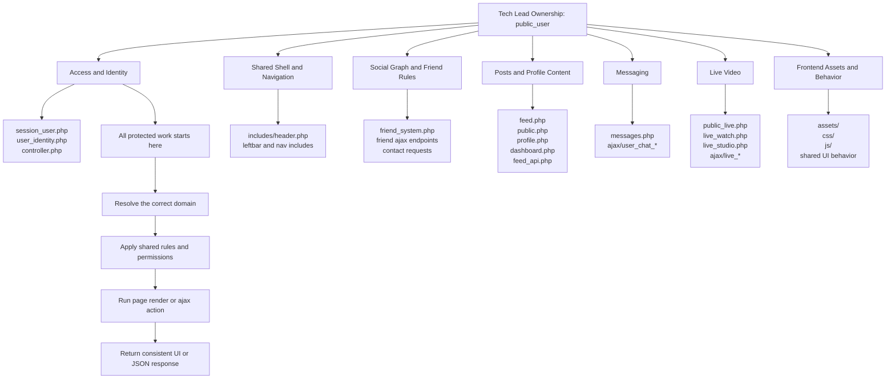

# Tech Lead Guide for public_user

Date: 2026-04-23

## Purpose

This document explains the recent Tech Lead pass on `public_user` in a clear, step-by-step way.

It is meant to answer:

1. what was reviewed
2. how the review was done
3. what technical problems were found
4. what decisions were made
5. what standards now apply to `public_user`
6. what should happen next

This is not a code-change log.

This is the architecture and execution guide for how the Tech Lead handled `public_user` recently.

## 1. What the Tech Lead recently did

The recent work was a technical leadership pass, not a feature build.

That means the work focused on:

- understanding the real structure of the codebase
- identifying which files and systems are becoming risky
- deciding what the correct engineering direction should be
- defining what is legacy, what is active, and what should be shared
- setting priorities so future changes are safer and less random

Important note:

- no code was changed in this specific Tech Lead pass
- no schema migration was added in this specific Tech Lead pass
- no UI redesign was implemented in this specific Tech Lead pass

The work completed here was review, architecture direction, risk assessment, and technical planning.

## 2. How the Tech Lead review was done

The review was done in phases instead of jumping directly into one file.

### Step 1. Map the project structure

The first step was to inspect the shape of the project.

Main areas confirmed:

- root PHP page files such as `feed.php`, `public.php`, `public_live.php`, `live_watch.php`, `profile.php`, `dashboard.php`, `messages.php`, and `live_studio.php`
- shared code in `includes/`
- action and polling endpoints in `ajax/`
- API endpoints in `api/`
- static frontend assets in `assets/`, `css/`, and `js/`
- shared database access in `controller.php`

Why this step mattered:

- technical direction should be based on the real runtime layout
- this shows where the product boundaries actually are
- it prevents making wrong assumptions about where logic lives

### Step 2. Measure file size and hotspot risk

The next step was to measure the largest and most important files.

Main hotspots found:

| File | Approx. size |
| --- | ---: |
| `feed.php` | 8959 lines |
| `messages.php` | 8098 lines |
| `live_studio.php` | 8351 lines |
| `live_watch.php` | 7485 lines |
| `includes/header.php` | 3665 lines |
| `public.php` | 3153 lines |
| `public_live.php` | 2822 lines |
| `profile.php` | 2759 lines |

Why this step mattered:

- very large files often hide mixed responsibilities
- changes inside these files are more likely to cause regressions
- large page files usually mean business logic, SQL, HTML, CSS, and JavaScript are mixed together

### Step 3. Trace auth, session, identity, and shared user state

Files reviewed:

- `controller.php`
- `includes/session_user.php`
- `includes/user_identity.php`
- `includes/friend_system.php`
- `includes/header.php`

Why this step mattered:

- these files affect many pages at once
- if shared identity or session logic is weak, almost every user-facing flow can break
- header behavior is cross-cutting because it touches unread counts, notifications, theme state, and navigation

### Step 4. Trace the feed, public posts, and profile surfaces

Files reviewed:

- `feed.php`
- `feed_api.php`
- `public.php`
- `profile.php`
- `dashboard.php`

Why this step mattered:

- feed and public-post behavior are a core product area
- these files revealed where post reads, post actions, profile rendering, and dashboard editing are duplicated
- this also showed whether one post API is already acting as the main shared backend

### Step 5. Trace the live product surface

Files reviewed:

- `public_live.php`
- `live_watch.php`
- `live_studio.php`
- `ajax/live_watch_room.php`
- `ajax/live_stream_host_poll.php`
- related `ajax/live_*` files

Why this step mattered:

- live behavior spans multiple pages and multiple AJAX endpoints
- viewer counts, room visibility, guest state, host state, and reactions must stay consistent across more than one screen
- live issues are usually cross-cutting, not isolated to one file

### Step 6. Trace the chat and notification surface

Files reviewed:

- `messages.php`
- `chat.php`
- `includes/chat_lib.php`
- `ajax/user_chat_poll.php`
- `ajax/user_chat_send.php`
- `ajax/chat_poll.php`
- notification logic in `includes/header.php`

Why this step mattered:

- messaging is one of the most dangerous places to allow architecture drift
- this review was needed to determine which chat system is active, which is legacy, and which one should receive future work

### Step 7. Identify duplication, coupling, and boundary problems

After reviewing the main product surfaces, the next step was not to patch anything immediately.

Instead, the focus was to answer:

- which logic is duplicated
- which shared components are overloaded
- which systems are fragmented
- where future development should be allowed
- where future development should be blocked

### Step 8. Set technical direction and priorities

The final step was to define the engineering direction for `public_user`.

That included:

- what stack is canonical for posts
- what stack is canonical for direct messaging
- which pages are legacy
- which cross-page systems need refactoring first
- what standards future work should follow

## 3. Main findings from the review

The review found several architecture problems that matter more than individual bugs.

### Finding 1. Page files are carrying too many responsibilities

The biggest pages are doing too much in one place.

Common mix inside one file:

- SQL queries
- permission checks
- HTML rendering
- large inline CSS blocks
- large inline JavaScript blocks
- API wiring
- UI state logic

This is true especially in:

- `feed.php`
- `messages.php`
- `live_studio.php`
- `live_watch.php`
- `public.php`

Risk:

- small changes become high-regression changes
- developers are encouraged to keep adding one-off patches into giant files
- shared behavior becomes harder to keep consistent

### Finding 2. Shared helper logic is duplicated in multiple places

The same kinds of helpers appear in more than one file.

Examples of duplicated helper types:

- avatar helpers
- initials helpers
- escaping helpers
- layout marker helpers
- viewer/modal helpers

Examples found:

- avatar-related logic appears in `includes/header.php` and `messages.php`
- post viewer JavaScript appears in both `feed.php` and `profile.php`
- post layout marker helpers appear in both `public.php` and `dashboard.php`

Risk:

- one page gets fixed while another page stays outdated
- same feature behaves slightly differently across screens
- shared UI becomes inconsistent over time

### Finding 3. `includes/header.php` is too heavy and too coupled

The header is not just rendering navigation.

It is also handling:

- appearance mode
- current user display state
- unread chat thread summary
- friend request counts
- notification lists
- avatar behavior
- page-specific rail logic

Risk:

- header changes can break feed, public, dashboard, messages, and other pages at once
- shared state logic is harder to test because it is embedded inside a large shared include

### Finding 4. Post data logic is spread across multiple page files

Post reads and post rendering logic are duplicated across:

- `feed.php`
- `public.php`
- `profile.php`
- `dashboard.php`
- `feed_api.php`

What this means:

- the same post domain is being handled in multiple places
- some actions are centralized in `feed_api.php`, but read/query behavior is still spread out

Risk:

- visibility rules can drift
- counts can drift
- profile/public/feed can show the same post differently for non-product reasons

### Finding 5. Messaging is fragmented into multiple systems

The review found more than one messaging model in the codebase.

Main messaging models found:

1. `messages.php` with `ajax/user_chat_*` using the `feedback` table
2. `chat.php` using `conversations`, `conversation_participants`, and `messages`
3. `includes/chat_lib.php` using `chat_messages`

This is not a small detail.

This is an architecture problem.

Risk:

- developers may add features to the wrong chat stack
- unread logic and permissions can behave differently across paths
- maintenance cost rises because one product area has multiple backends

### Finding 6. Live behavior is spread across pages and AJAX endpoints

The live product area spans:

- discovery in `public_live.php`
- studio/host behavior in `live_studio.php`
- watch behavior in `live_watch.php`
- room state and counters in `ajax/live_watch_room.php`
- more actions in other `ajax/live_*` endpoints

Risk:

- viewer counts can drift between host and watcher views
- room visibility rules can be implemented slightly differently across screens
- debugging live issues becomes harder because state is split across many files

### Finding 7. Runtime schema changes are happening inside request paths

The review found request-time schema work such as:

- `CREATE TABLE IF NOT EXISTS`
- `ALTER TABLE`
- `SHOW TABLES`
- `SHOW COLUMNS`
- `information_schema` checks

This pattern appears in important runtime paths such as:

- `messages.php`
- `ajax/live_watch_room.php`
- `live_studio.php`

Risk:

- request handlers become slower and more brittle
- production behavior depends on page hits instead of deliberate migrations
- schema ownership becomes unclear

### Finding 8. Session access is not fully normalized

Some files use helper functions consistently.

Other files still read raw session keys directly and sometimes use legacy fallbacks.

Risk:

- identity bugs are more likely
- developers may copy inconsistent session access patterns into new files
- shared auth behavior becomes harder to enforce

## 4. Technical decisions made by the Tech Lead

Based on the review, the following engineering decisions now define the direction for `public_user`.

### Decision 1. `feed_api.php` is the canonical post action API

For public/friends post actions, the backend direction is:

- use `feed_api.php` as the main action backend for shared post behavior

This includes actions such as:

- view
- react
- share
- save
- comment
- mark read
- delete

Direction:

- do not create new one-off post-action endpoints when the action belongs to the same post domain
- instead, extend the shared post action layer cleanly

### Decision 2. `messages.php` plus `ajax/user_chat_*` is the active direct-message path

For direct messaging, the chosen supported path is:

- `messages.php`
- `ajax/user_chat_poll.php`
- `ajax/user_chat_send.php`
- related `ajax/user_chat_*` endpoints

Direction:

- new direct-message features should go here
- `chat.php`, `includes/chat_lib.php`, and the older `ajax/chat_*` flow should be treated as legacy paths
- legacy chat paths should not receive new product features unless there is a specific migration reason

### Decision 3. Live is one product area, not separate page-level islands

The live stack should be treated as one system:

- `public_live.php`
- `live_watch.php`
- `live_studio.php`
- `ajax/live_*`

Direction:

- viewer counts, visibility rules, guest state, room state, reactions, and live metadata must be owned as one shared live domain
- future changes must be reviewed for host and watcher impact together

### Decision 4. `includes/header.php` should become render-focused over time

The header should gradually stop being the home for large state-loading logic.

Direction:

- keep header as the shared shell and renderer
- move heavy data loading into focused helper functions or smaller includes
- prevent more business logic from being embedded directly in the header

### Decision 5. No more request-time schema management for normal product work

Direction:

- schema creation and schema mutation should not be added to normal request paths
- migration behavior should be deliberate and separated from everyday page loads and polling

### Decision 6. Giant files should be reduced by extracting shared domains, not random splitting

Direction:

- do not split files mechanically just to create more files
- extract by responsibility
- move duplicated logic into shared helpers or shared assets only when the ownership boundary is clear

## 5. Architecture for how the Tech Lead handles public_user

This section explains the architecture model the Tech Lead should use when leading `public_user`.

It is not only about files.

It is about ownership, boundaries, and decision flow.

### 5.0 Architecture screen

This is the quick visual view of how the Tech Lead should look at `public_user`.

### 5.1 The app should be treated as a set of shared product domains

`public_user` should not be managed as one giant flat PHP folder.

It should be understood as several connected domains:

1. Access and identity domain
2. Shared shell and navigation domain
3. Social graph and relationship domain
4. Posts and profile-content domain
5. Messaging domain
6. Live video domain
7. Frontend behavior and asset domain

### 5.2 Access and identity domain

Main files:

- `includes/session_user.php`
- `includes/user_identity.php`
- `controller.php`

Purpose:

- validate the logged-in user
- expose stable current-user helpers
- protect private pages and actions
- provide shared database access

Tech Lead rule:

- every protected flow should depend on this layer first
- identity access patterns should be normalized here, not reinvented inside pages

### 5.3 Shared shell and navigation domain

Main files:

- `includes/header.php`
- `includes/leftbar.php`
- `includes/navleftbar.php`
- `includes/sidebarleft.php`

Purpose:

- render shared navigation
- show theme state
- show notification and unread summaries
- provide cross-page entry points into the app

Tech Lead rule:

- shared shell UI belongs here
- heavy state-loading logic should gradually move into smaller shared helpers
- no feature should casually inject more business logic into the header without checking cross-page impact

### 5.4 Social graph and relationship domain

Main files:

- `includes/friend_system.php`
- `contact_requests.php`
- `contacts.php`
- `ajax/friend_action.php`
- `ajax/friend_status.php`

Purpose:

- resolve friend state
- send or accept requests
- decide relationship-based visibility
- support profile, live, and feed access rules

Tech Lead rule:

- friend and visibility rules should be shared rules
- they should not drift separately inside feed, profile, public live, and watcher pages

### 5.5 Posts and profile-content domain

Main files:

- `dashboard.php`
- `feed.php`
- `feed_api.php`
- `public.php`
- `profile.php`
- `includes/post_categories.php`

Purpose:

- create and edit posts
- render friends and public content
- manage reactions, comments, shares, saves, and read state
- render post-related profile surfaces

Tech Lead rule:

- `feed_api.php` is the action center for this domain
- page files should increasingly become render/orchestration layers
- shared post queries and shared viewer behavior should be extracted instead of copied

### 5.6 Messaging domain

Main files:

- `messages.php`
- `ajax/user_chat_poll.php`
- `ajax/user_chat_send.php`
- related `ajax/user_chat_*`

Legacy files:

- `chat.php`
- `includes/chat_lib.php`
- `ajax/chat_*`

Purpose:

- provide direct-message behavior
- support thread loading, unread state, attachments, reactions, and chat UI behavior

Tech Lead rule:

- one messaging direction must be preferred
- future feature work should follow the active `messages.php` path
- legacy messaging paths should be contained, not expanded

### 5.7 Live video domain

Main files:

- `public_live.php`
- `live_watch.php`
- `live_studio.php`
- `ajax/live_*`

Purpose:

- live discovery
- host studio control
- watcher room behavior
- viewer counts
- guest requests
- live comments and reactions

Tech Lead rule:

- live is one shared domain with multiple entry points
- host-side and watcher-side changes must be reviewed together
- viewer counts, room status, and access rules should not be owned separately by different pages

### 5.8 Frontend behavior and asset domain

Main files:

- `assets/`
- `css/`
- `js/`
- inline page scripts and styles inside the main PHP pages

Purpose:

- handle modals, polling, state updates, layouts, themes, and interaction behavior

Tech Lead rule:

- repeated frontend logic should become shared assets
- page-local hacks should not quietly become the permanent architecture
- shared JS and CSS should be extracted by responsibility, not only because files are large

### 5.9 How the Tech Lead should make architecture decisions

When handling `public_user`, the Tech Lead should use this decision order:

1. identify the real domain involved
2. identify whether the change touches a shared cross-page boundary
3. decide whether the task is a safe patch, a refactor, or a redesign
4. choose one canonical place for the logic to live
5. block new duplication if the same problem already exists elsewhere

In practice, that means:

- if a bug only affects one isolated page, a small patch may be enough
- if the same rule appears in multiple files, the work should move toward refactoring
- if a system already has multiple active implementations, the work should be treated as architecture cleanup, not another patch

### 5.10 How the Tech Lead should choose patch vs refactor vs redesign

Patch:

- use when the issue is local, low-risk, and does not touch a shared product rule

Refactor:

- use when the same logic is duplicated, when a shared helper is overloaded, or when more than one page is affected

Redesign:

- use when the system has split ownership, conflicting data models, or long-term instability

Examples inside `public_user`:

- a single button label issue on one page is usually a patch
- duplicated post viewer code across feed and profile is a refactor
- multiple active direct-message implementations is a redesign-level architecture problem

### 5.11 How work should flow through the architecture

The preferred flow for product work in `public_user` is:

1. request enters through auth and identity validation
2. the page or endpoint resolves the domain it belongs to
3. shared domain rules are applied
4. reads and writes happen through the correct shared path
5. page rendering or JSON response happens after permissions and domain logic are settled
6. shared UI and frontend behavior consume the result consistently

This is the architecture model the Tech Lead should keep reinforcing.

It helps prevent:

- random logic placement
- duplicate business rules
- header regressions
- inconsistent live state
- inconsistent chat behavior
- repeated feed/profile/public drift

## 6. What the Tech Lead decided should happen next

The recommended engineering plan is phased so the cleanup stays safe.

### Phase 1. Stabilize shared identity, session usage, and header state

Goal:

- reduce cross-page regression risk

Main work:

- normalize current-user/session access
- centralize shared avatar and identity helpers
- reduce query/state-loading responsibility inside `includes/header.php`

Why this phase is first:

- many pages depend on the same user identity and shared shell behavior

### Phase 2. Unify the post domain

Goal:

- make feed, public, profile, and dashboard use clearer shared rules

Main work:

- extract shared post query helpers
- reduce duplicated post read logic
- keep `feed_api.php` as the canonical action layer
- move duplicated post-viewer JavaScript into shared frontend assets

Why this phase matters:

- post behavior is visible across multiple core user pages

### Phase 3. Unify the messaging direction

Goal:

- stop architecture drift in chat

Main work:

- clearly mark `messages.php` stack as the active direct-message system
- freeze new feature work on legacy chat paths
- prepare future migration or retirement of duplicate chat stacks

Why this phase matters:

- chat fragmentation causes long-term maintenance problems fast

### Phase 4. Unify the live domain

Goal:

- make studio, watch, and live discovery behave consistently

Main work:

- extract shared live permission checks
- centralize shared live room state handling
- centralize viewer-count and room-status rules
- remove more page-level duplication between live surfaces

Why this phase matters:

- live bugs are usually multi-page bugs

### Phase 5. Cleanup and legacy reduction

Goal:

- reduce long-term drag after core stability improves

Main work:

- retire dead/legacy flows where possible
- remove duplicated helper implementations
- reduce request-time schema checks
- reduce giant inline CSS and JS blocks in page files

## 7. Standards now set for public_user

These are the working standards that should guide future implementation.

### 7.1 Where logic should live

Page file:

- request orchestration
- page-specific rendering
- light composition of shared pieces

Shared include:

- small shared rendering pieces
- small shared helper wrappers
- not large mixed business logic if avoidable

Helper function:

- pure reusable logic
- shared visibility rules
- shared identity helpers
- shared formatting or shared query builders

API or AJAX endpoint:

- authenticated user action
- permission check
- domain mutation
- JSON response

Frontend script:

- UI behavior
- modal state
- polling orchestration
- DOM updates

### 7.2 Security and permission standards

Rules:

- all protected pages and actions must enter through session validation first
- permission rules should be consistent across page render and AJAX behavior
- do not trust the UI alone for visibility or friend access
- cross-user actions must validate the current user on the server side every time

### 7.3 SQL standards

Rules:

- prefer shared domain queries over repeated page-level SQL where possible
- avoid growing page files with more duplicated SQL blocks
- do not add new runtime schema creation to normal request paths
- keep database writes explicit and domain-owned

### 7.4 CSS and JavaScript standards

Rules:

- do not keep expanding giant inline CSS and JS blocks in page files
- extract truly shared behavior into shared assets
- if a UI behavior exists in more than one page, treat it as shared code

### 7.5 Naming and consistency standards

Rules:

- one domain should have one clearly preferred implementation path
- avoid multiple active ways to solve the same business problem
- reuse shared naming for identity, friend state, post actions, and live state

## 8. What the Tech Lead did not do in this pass

To keep the work clear, these things were not done in this recent pass:

- no feature implementation
- no live redesign
- no feed redesign
- no message migration
- no schema migration
- no deletion of legacy code
- no blind file splitting

That was intentional.

The job of this pass was to establish technical direction first, so future implementation work can be safer and more deliberate.

## 9. Clear summary

In simple terms, the Tech Lead work recently did this:

1. inspected the real structure of `public_user`
2. identified the riskiest files and cross-cutting systems
3. found the biggest architecture problems:
   - giant mixed-responsibility page files
   - duplicated helper logic
   - overloaded shared header logic
   - fragmented messaging systems
   - split live-room ownership
   - request-time schema management
4. decided the supported direction for posts, messages, live, and shared header behavior
5. defined the next engineering phases and standards for future work

## 10. Final Tech Lead conclusion

`public_user` is not failing because of one bad file.

The main risk is that several important product areas are growing without strong boundaries:

- posts
- live
- messaging
- shared header state
- session and identity access

The recent Tech Lead pass was used to stop that drift.

The result of this pass is a clear direction:

- keep post actions centered
- treat `messages.php` as the active direct-message product
- treat live as one shared domain
- reduce header coupling
- stop adding more random duplication
- extract shared logic by responsibility, not by guesswork

That is how the recent Tech Lead work was handled for `public_user`.
